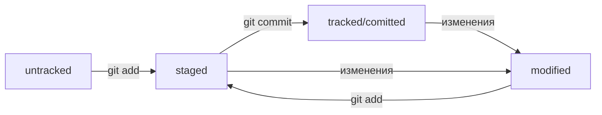
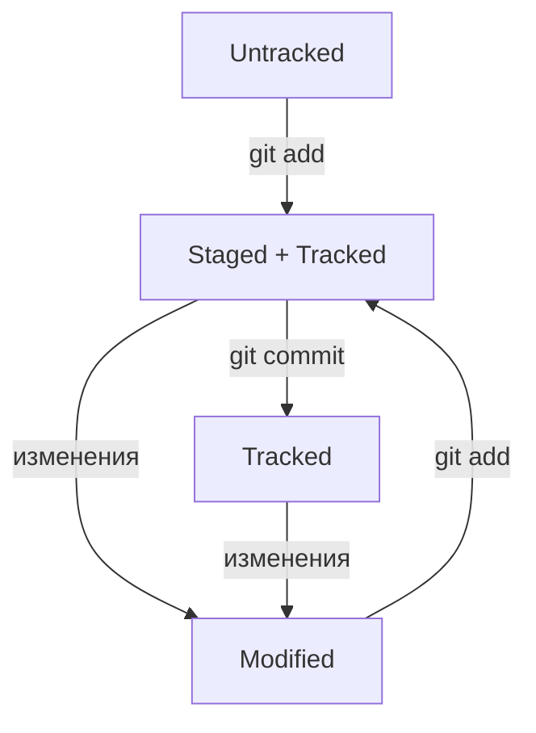

# Шпаргалка по Git
*по материалам курса Яндекс Практикум*

## 1. Инициализируем репозиторий

`git init` - **Сделать папку репозиторием**

$ cd ~/dev/first-project # перешли в нужную папку

$ git init # создали репозиторий

Можно создать папку в любом месте на компьютере. Но не забывать менять в наших примерах путь ~/dev/first-project на тот, который ведёт к вашей папке.  _Не рекомендуется создавать репозиторий Git внутри другого Git-репозитория._

--- 

`rm -rf .git` - **«Разгитить» папку, если что-то пошло не так**

$ cd <папка с репозиторием> # перешли в папку

$ rm -rf .git # удалили подпапку .git

---
`git status` - **Проверить состояние репозитория**

## 2. Добавляем файлы в репозиторий

`git add` - **Подготовить файлы к сохранению**

git add --all # подготовили к сохранению все файлы в репозитории

Добавлять файлы можно и по одному, без ключа --all.  
$ git add todo.txt  
$ git add readme.txt  
$ git status  

Также можно добавить текущую папку целиком — в этом случае все файлы в ней тоже будут добавлены.  
$ git add . # добавить всю текущую папку  
$ git status  

## 3. Делаем commit

`git commit` - **Выполнить commit**

Сделать коммит можно командой git commit c ключом -m (от англ. message — «сообщение»), который присваивает коммиту сообщение.

`$ git commit -m "Мой первый коммит!"`

**Разница между `git add` и `git commit`**: команда `git add` сообщает Git, какие именно файлы нужно сохранить и какую их версию. Затем с помощью команды `git commit` происходит само сохранение. 

## 4. Просматриваем историю коммитов

`git log` - **Просмотреть историю коммитов**.

```bash
$ git log
commit b47bf3eab5ff907c4a6ebe34b676d95bdc51d5df (HEAD -> main, git-describe-repo/main)
Author: AlexV <alexvarnik@gmail.com>
Date:   Fri Jun 23 10:34:51 2023 +0300

    `добавлены разделы до 7-го включительно`

commit 0341bd0bf797082b8f7cc5112df2d28116b80937
Author: AlexV <alexvarnik@gmail.com>
Date:   Thu Jun 22 14:58:56 2023 +0300

    создан четвертый раздел
```

- Git преобразует информацию о коммитах с помощью алгоритма SHA-1 и для каждого из них рассчитывает уникальный идентификатор — хеш.
- Хеш — основной идентификатор коммита и позволяет узнать его автора, дату и содержимое закоммиченных файлов.
- Все хеши, а также таблицу соответствий хеш → информация о коммите Git хранит в папке .git.

`git log --oneline` - Получить сокращённый лог.

В сокращённом логе выводятся сокращённые хеши — их можно использовать точно так же, как и полные.

```
Обратите внимание: если выход из просмотра логов не произошёл автоматически,
нажмите клавишу Q (от англ. Quit — «выйти») в английской раскладке клавиатуры.
```


## 5. GitHub
### 5.1. Регистрация

1. В правом верхнем углу главной страницы GitHub нажмите на Sign up (англ. «зарегистрироваться»).

2. На экране будут последовательно появляться поля для ввода.
2.1. Введите адрес электронной почты (англ. Enter your email).
2.2. Придумайте пароль (англ. Create a password).
2.3. Введите имя пользователя (англ. Enter a username).
3. Платформа спросит, хотите ли вы получать на почту рассылку с обновлениями и новостями (англ. Would you like to receive product updates and announcements via email?). Введите y, если хотите получать рассылку, или n, если не хотите.
Нажмите кнопку Continue (англ. «продолжить»).
4. Нажмите кнопку Continue (англ. «продолжить»).
5. GitHub предложит вам пройти капчу. Сделайте это.
6. После прохождения капчи нажмите Create account (англ. «создать аккаунт»).
7. Введите короткий код, который будет отправлен на указанный вами почтовый адрес.

### 5.2. Создание репозитория на GitHub

1. Зайдите в свой профиль по ссылке `https://github.com/username`.
2. Создайте репозиторий. Для этого перейдите на вкладку Repositories (англ. «репозитории»), а затем нажмите на зелёную кнопку New (англ. «новый») справа.
3. Укажите имя репозитория, выберите тип Публичный или Приватный, и нажмите кнопку `Create repository`.

### 5.3 Генерируем ssh-ключ

1. Для генерации ssh-пары можно использовать команды:  
`$ ssh-keygen -t ed25519 -C "электронная почта, к которой привязан ваш аккаунт на GitHub"`  
или  
`$ ssh-keygen -t rsa -b 4096 -C "электронная почта, к которой привязан ваш аккаунт на GitHub"`

### 5.4 Привязываем SSH-ключ к GitHub

1. Скопируйте содержимое файла с публичным ключом в буфер обмена.  
`# скопировать содержимое ключа в буфер обмена:`  
`$ clip < ~/.ssh/id_rsa.pub`  
`# для ed25519:`  
`$ clip < ~/.ssh/id_ed25519.pub`  
Если clip не сработает, выведите содержимое файла с помощью cat ~/.ssh/id_rsa.pub или cat ~/.ssh/id_ed25519.pub и скопируйте вывод в буфер обмена из консоли.  
2. Перейдите на GitHub и выберите пункт __Settings__ (англ. «настройки») в меню аккаунта.
3. В меню слева нажмите на пункт __SSH and GPG keys__.
4. В открывшейся вкладке выберите __New SSH key__ (англ. «новый SSH-ключ»).
5. В поле Title (англ. «заголовок») напишите название ключа. Например, Personal key (англ. «личный ключ»).
6. В поле Key type (англ. «тип ключа») должно быть Authentication Key (англ. «ключ аутентификации»).
7. В поле Key скопируйте ваш ключ из буфера обмена.
8. Нажмите на кнопку __Add SSH key__ (англ. «добавить SSH-ключ»).
9. Проверьте правильность ключа с помощью следующей команды.
`$ ssh -T git@github.com.`  
Если это первый раз, когда вы используете Git, то появится предупреждение, на которое нужно ответить __`y`__.  
Затем на экране появится приветствие:  
`i %ВАШ_АККАУНТ%! You've successfully authenticated, but GitHub does not provide shell access.`

## 6. Связываем локальный и удалённый репозитории

### 6.1 Привязать удалённый репозиторий к локальному

`git remote add` - Привязать удалённый репозиторий к локальному.  

Перейдите на страницу удалённого репозитория, выберите тип SSH и скопируйте URL. Кнопка справа позволит сделать это мгновенно.

Откройте консоль, перейдите в каталог локального репозитория и введите команду git remote add (от англ. remote — «удалённый» и add — «добавить»).

$ cd ~/dev/first-project
$ git remote add origin git@github.com:%ИМЯ_АККАУНТА%/first-project.git

Команде необходимо передать два параметра: имя удалённого репозитория и его URL. В качестве имени используйте слово origin. А URL вы скопировали со страницы удалённого репозитория.

`origin` (англ. «источник») — стандартный псевдоним, с помощью которого можно обращаться к главному удалённому репозиторию (обычно такой репозиторий один). Это значительно упрощает работу.

### 6.2 Убедиться, что репозитории связаны

`git remote -v` - Убедиться, что репозитории связаны.

$ git remote -v
origin    git@github.com:%ИМЯ_АККАУНТА%/%ИМЯ-ПРОЕКТА%.git (fetch)
origin    git@github.com:%ИМЯ_АККАУНТА%/%ИМЯ-ПРОЕКТА%.git (push)

В выводе вы должны увидеть две строчки, аналогичные тем, что показаны выше.
Флаг `-v` — короткая форма флага `--verbose` (англ. «подробный»). Он позволяет показать больше информации в выводе.

## 7. Синхронизируем локальный и удалённый репозитории

Самая первая ветка в репозитории появляется автоматически и называется main (англ. «основная») или master. Её имя нужно указывать при отправке коммитов на удалённый репозиторий или при получении их из него.

`git push` - Отправить изменения на удалённый репозиторий.

В первый раз эту команду нужно вызвать с флагом -u и параметрами origin (имя удалённого репозитория) и main или master (название текущей ветки). Флаг -u свяжет локальную ветку с одноимённой удалённой. Как вы связывали локальный и удалённый репозитории в предыдущем пункте, так же и здесь нужно дополнительно связать ветки.

$ git push -u origin main `# Если команда приведёт к ошибке, попробуйте заменить main на master.`

Появится экран с информацией. При взаимодействии с удалёнными репозиториями Git выводит в консоль отладочную информацию: количество объектов (файлов), которые отправляются на сервер, информацию о прогрессе сжатия и записи и так далее.

Если вы указывали кодовую фразу при настройке SSH-ключей, её нужно будет ввести.  
Зайдите в репозиторий first-project на GitHub. Вы увидите, что в репозитории появились файлы с изменениями.

## 8. Файл HEAD

Файл `HEAD` (англ. «голова», «головной») — один из служебных файлов папки `.git`. Он указывает на коммит, который сделан последним (то есть на самый новый).

```bash
$ cat HEAD # команда cat показывает содержимое файла
ref: refs/heads/master # в файле вот такая ссылка 
```

Внутри `HEAD` — ссылка на служебный файл: `refs/heads/master` (или `refs/heads/main` в зависимости от названия ветки). Если заглянуть в этот файл, можно увидеть хеш последнего коммита.

```bash
$ cat refs/heads/master # взяли ссылку из файла HEAD
# внутри хеш
e007f5035f113f9abca78fe2149c593959da5eb7

$ git log 
# сверяем с хешем последнего коммита
commit e007f5035f113f9abca78fe2149c593959da5eb7
Author: John Doe <johndoe@example.com>
Date:   Tue Mar 28 00:26:53 2023 +0300

    Добавить амбиций в список дел

... # другие коммиты
```

Если нужно передать последний коммит, то вместо его хеша можно просто написать слово `HEAD` — Git поймёт, что вы имели в виду последний коммит.


## 9. Статусы файлов в Git

__Статусы `untracked`/`tracked`, `staged` и `modified`__
Одна из ключевых задач Git — отслеживать изменения файлов в репозитории. Для этого каждый файл помечается каким-либо статусом. Рассмотрим основные.
- __`untracked`__ (англ. «неотслеживаемый»)

Мы говорили, что новые файлы в Git-репозитории помечаются как untracked, то есть неотслеживаемые. Git «видит», что такой файл существует, но не следит за изменениями в нём. У untracked-файла нет предыдущих версий, зафиксированных в коммитах или через команду git add.

- __`staged`__ (англ. «подготовленный»)

  После выполнения команды git add файл попадает в staging area (от англ. stage — «сцена», «этап [процесса]» и area — «область»), то есть в список файлов, которые войдут в коммит. В этот момент файл находится в состоянии staged.
  В одном из предыдущих уроков мы сравнили коммит с фотографией. Можно развить эту аналогию и сказать, что команда git add добавляет персонажей (текущее содержимое файла или нескольких файлов) на сцену (англ. stage) для общей фотографии, а git commit делает снимок всей сцены целиком. 
  
```  
   Staging area, index и cache
Staging area также называют index (англ. «каталог») или cache (англ. «кеш»),
а состояние файла staged иногда называют indexed или cached.

Все три варианта могут встречаться в документации и в качестве флагов команд Git.
А также в интернете — например, в вопросах и ответах на сайте Stack Overflow.
```

- __`tracked`__ (англ. «отслеживаемый»)

Состояние tracked — это противоположность untracked. Оно довольно широкое по смыслу: в него попадают файлы, которые уже были зафиксированы с помощью git commit, а также файлы, которые были добавлены в staging area командой git add. То есть все файлы, в которых Git так или иначе отслеживает изменения.

- __`modified`__ (англ. «изменённый»)

Состояние modified означает, что Git сравнил содержимое файла с последней сохранённой версией и нашёл отличия. Например, файл был закоммичен и после этого изменён.

``` 
    Для файлов в состояниях staged и modified обычно не указывают,
    что они также tracked, потому что это состояние подразумевается.
```

- Статусом `untracked` помечается файл, о существовании которого Git знает, но не следит за изменениями в нём. Этот статус — противоположность `tracked`, в который попадают все файлы, отслеживаемые Git.
- Файл переходит в статус `staged` после выполнения `git add`.
- Статус `modified` означает, что файл был изменён.
- Большинство файлов в проектах «шагает» по следующему циклу: «изменён» → «добавлен в список на коммит» → «закоммичен» → «изменён» → и так далее.






## 10. Оформление сообщений к коммитам

У каждого коммита в Git есть сообщение — то, что передаётся после параметра `-m`. Например: `git commit -m "Добавить урок про оформление сообщений коммитов".`

Есть общие рекомендации по тому, как правильно составить сообщение. Оно должно быть:
- относительно коротким, чтобы его было легко прочитать;
- информативным.

### 10.1 Стили оформления

Чтобы упростить работу, команды или даже целые компании часто договариваются об определённом стиле (то есть о правилах) оформления сообщений коммитов.  
Например, правила могут быть такие:
- длина сообщения от 30 до 72 символов;
- первое слово — глагол в инфинитиве («исправить», «дополнить», «добавить» и другие);
- и так далее.

Есть много подходов к оформлению сообщений коммитов. Их используют как отдельные команды, так и целые проекты.  
Например:  

**Корпоративный**  

Во многих компаниях применяется Jira — система для организации проектов и задач. У каждой задачи в Jira есть идентификатор из нескольких заглавных латинских букв и номера. Например, `LGS-239` значит, что это это $239$-я задача в проекте **LGS** (сокращение от англ. **l**o**g**istic**s** — «логистика»).  
В корпоративном стиле в начале сообщения обычно указывают Jira-ID, а после — текст сообщения.  
```bash
$ git commit -m "LGS-239: Дополнить список пасхалок новыми числами"
```

**Conventional Commits**  

Стандарт **Conventional Commits** (англ. «соглашение о коммитах») отличается качественной документацией и подробной проработкой. Он подходит для репозиториев с исходным кодом программ. Использовать его для других типов проектов (например, для перевода книги) было бы неудобно.
Conventional Commits предлагает такой формат коммита: `<type>: <сообщение>`. Первая часть `type` — это тип изменений. Таких типов достаточно много. Вот два примера:
- `feat` (англ. «навык») — для новой функциональности;
- `fix` (от англ. «исправить», «устранить») — для исправленных ошибок.
Более подробный список можно увидеть [на сайте с описанием этого стиля](https://www.conventionalcommits.org/ru/v1.0.0-beta.4/#спецификация).

**GitHub-стиль**  

GitHub можно использовать не только для хранения файлов проекта, но и для ведения списка **задач** (англ. issue) этого проекта. Если коммит «закрывает» или «решает» какую-то задачу, то в его сообщении удобно указывать ссылку на неё. Для этого в любом месте сообщения нужно указать `#<номер задачи>`. Например, вот так.

```bash
$ git commit -m "Исправить #334, добавить график температуры"
```

## 11. Как исправить коммит

Можно внести правки в уже сделанный коммит с помощью опции `--amend` (от англ. amend — «исправить», «дополнить») у команды `commit`:  
`git commit --amend`  

```
Важно: опция --amend работает только с последним коммитом (HEAD).
Для исправления более ранних коммитов есть другие команды.
```

__`git commit --amend --no-edit`__ -  Дополнить коммит новыми файлами.


__`git commit --amend -m "Новое сообщение"`__ - Изменить сообщение коммита.


```bash
$ git commit --amend -m "Добавить главную страницу и стили"
$ git log --oneline
a31fa24 Добавить главную страницу и стили
```

## 12. Как откатиться назад, если "всё сломалось"

__Выполнить unstage изменений__

__`git restore --staged <file>`__ - Выполнить unstage изменений для указанного файла

В выводе команды `git status` есть подсказка в скобках:  
`use "git restore --staged <file>..." to unstage`.  
Так что, даже если вы и забыли эту команду, Git напомнит вам.

__`git restore --staged`__ - Сбросить все файлы из `staged` обратно в `untracked/modified`.


__«Откатить» коммит__

__`git reset --hard <commit hash>`__ - Откатить коммит.

Иногда нужно «откатить» то, что уже было закоммичено, то есть вернуть состояние репозитория к более раннему.
Для этого используют команду `git reset --hard <commit hash>` (от англ. reset  — «сброс», «обнуление» и hard — «суровый»).
    
__«Откатить» изменения, которые не попали ни в staging, ни в коммит__

__`git restore <file>`__ - «Откатить» изменения, которые не попали ни в staging, ни в коммит.

Может быть так, что вы случайно изменили файл, который не планировали. Теперь он отображается в `Changes not staged for commit (modified)`. Чтобы вернуть всё «как было», можно выполнить команду `git restore <file>`.

Изменения в файле «откатятся» до последней версии, которая была сохранена через `git commit` или `git add`.


## 13. Просматриваем изменения в файлах

__`git diff`__ - сравнить последнюю закоммиченную версию файла с той, что находится в состоянии modified.

__`git diff --staged`__ - сравнить последнюю версию файла с той, что находится в состоянии staged.

__`git diff <коммит1> <коммит2>`__ - сравнить изменения в двух коммитах.


## 14. Игнорирование файлов в Git

Часто бывает так, что в папке-репозитории есть файлы, для которых не нужно хранить историю изменений. 
Чтобы Git игнорировал такие файлы и не пытался добавить их в репозиторий, нужно создать файл `.gitignore` (от англ. ignore — «игнорировать») и записать в него названия игнорируемых файлов.

С точки зрения Git `.gitignore` — это обычный текстовый файл. Его добавляют в корень репозитория и тоже коммитят.

_Правила из `.gitignore` применяются только к новым (`untracked`) файлам. Если файл уже попал в staging area или в коммит, то правила на него не распространяются._

Разберём подробнее формат файла .gitignore, какие в нём могут встречаться строки и как выглядят шаблоны.

__Просто название файла__

Допустим, нужно, чтобы Git игнорировал все файлы .DS_Store. Для этого достаточно добавить в .gitignore строку с названием файла.

```bash
# для macOS
.DS_Store
```

В таком случае Git будет игнорировать файлы с именем .DS_Store, причём не только в корне репозитория, но и во всех вложенных папках.

__Звёздочка (`*`)__

Символ звёздочки (`*`) соответствует любой строке, включая пустую. Если такой символ используется в шаблоне в `.gitignore`, значит, файл будет проигнорирован вне зависимости от того, что будет на месте звёздочки.

```bash
# игнорировать все файлы, которые заканчиваются на .jpeg
*.jpeg

# игнорировать все файлы "tmp" во всех подпапках папки docs
docs/*/tmp
```

__Вопросительный знак (`?`)__

Вопросительный знак `?` соответствует одному любому символу.

```bash
file?.txt
```
Если сохранить такую запись в `.gitignore`, то будут проигнорированы, например, файлы `fileA.txt` и `file1.txt`. А вот файл `file12.txt` не будет проигнорирован, потому что в его названии два символа после file, а не один.


__Квадратные скобки (`[…]`)__
Квадратные скобки, как и вопросительный знак, соответствуют одному символу. При этом символ не любой, а только из списка, который указан в скобках.

```bash
# игнорировать файлы file0.txt, file1.txt и file2.txt
# при этом не игнорировать file3.txt, file4.txt, ...
file[0-2].txt
```

В скобках можно либо перечислить символы (`[abc]`), либо задать диапазон (`[a-z]`).

__Слеш (`/`)__

Косая черта, или слеш (`/`), указывает на каталоги. Если шаблон в `.gitignore` начинается со слеша, то Git проигнорирует файлы или каталоги только в корневой директории.

```bash
# игнорировать todo.txt в корне репозитория
/todo.txt

# для сравнения: spam.txt будет игнорироваться во всех папках
spam.txt
```

Теперь файл `todo.txt` в корневом каталоге будет проигнорирован. При этом, например, файл `subdir/todo.txt` по-прежнему отслеживается.
Если шаблон заканчивается слешем, то правило применится только к папке.

```bash
# игнорировать папку build
build/
```

Обратите внимание: если `build` — это папка, то она будет проигнорирована. Если `build` — обычный файл, то он не подпадёт под правило и не будет игнорироваться.

__Парные звёздочки (`**`)__

Функция парных звёздочек (`**`) похожа на функцию одинарной (`*`). Отличие в том, как они работают с вложенными папками. Двойная звёздочка может соответствовать любому количеству таких папок (в том числе нулю). Одинарная может соответствовать только одной.

```bash
# игнорировать файлы "docs/current/tmp", "docs/old/tmp",
# а также "docs/old/saved/a/b/c/d/tmp"
# и даже "docs/tmp", потому что ноль вложенных папок тоже подходит
docs/**/tmp

# игнорировать только "docs/current/tmp" и "docs/old/tmp"
# файл "docs/old/saved/a/b/c/d/tmp" не попадает в правило
docs/*/tmp
```

_Для двойной звёздочки верно то же самое, что и для одной: если задать правило `**`, то будут проигнорированы все файлы._

__Восклицательный знак (`!`)__

Любое правило в файле `.gitignore` можно инвертировать с помощью восклицательного знака (`!`).

```bash
# игнорировать все JPEG-файлы
*.jpeg

# но только не мем с Doge
!doge.jpeg
```

Теперь файл `doge.jpeg` будет отслеживаться, хотя остальные `jpeg-файлы` будут проигнорированы. Такие правила удобны для добавления исключений из других правил `.gitignore`.

__Пример файла `.gitignore`__

Содержание .gitignore может быть таким.

```bash
# игнорировать все файлы в каталоге build
build/

# игнорировать все .log файлы
*.log

# не игнорировать *.log файлы в examples
# потому что это пример для документации
!examples/**/*.log
```

__`.gitignore` и `git status`__

Игнорируемые файлы не отображаются в выводе команды `git status`, иначе они бы засоряли вывод.
Если всё же нужно отобразить все игнорируемые файлы, то это можно сделать с помощью ключа `--ignored`:  
__`git status --ignored`__ - в таком случае в выводе git status появится раздел Ignored files.


